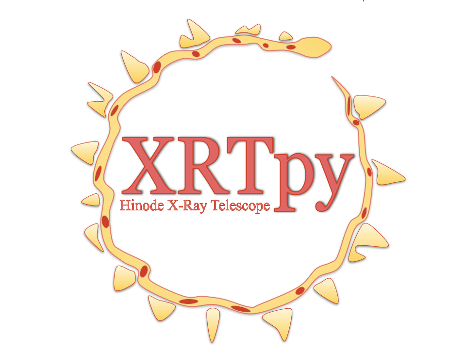

  

# XRTpy

XRTpy is a Python package being developed for the analysis of observations made by the X-Ray Telescope (XRT) on the **Hinode** spacecraft.

## Documentation

Check out our full documentation site for examples, installation instructions, and how to get started:
[XRTpy Documentation](https://xrtpy.readthedocs.io/en/latest/)

## Installation

Follow the [installation guide](https://xrtpy.readthedocs.io/en/latest/install.html) to get XRTpy running locally.

## Feedback and Bug Reports

Found an issue or have suggestions? Open an issue on our [GitHub Issues page](https://github.com/HinodeXRT/xrtpy/issues).

## Contributing

We welcome contributions!
See our [Contributing Guide](https://xrtpy.readthedocs.io/en/latest/contributing.html) for how to get started.

## Contact

For general questions, feel free to reach out to us at:
**XRTpy@cfa.harvard.edu**

## Citation

If you use XRTpy in your research, please cite our software:
[DOI: 10.5281/zenodo.13157914](https://doi.org/10.5281/zenodo.13157914)

Velasquez, Joy; Reeves, Katharine; Murphy, Nicholas; Slavin, Jonathan; Weber, Mark; Barnes, Will.
*XRTpy: A Hinode X-Ray Telescope Python Package*.
Journal of Open Source Software, 2024.

## Acknowledgements

The development of XRTpy is supported by NASA contract **NNM07AB07C** to the Smithsonian Astrophysical Observatory.
