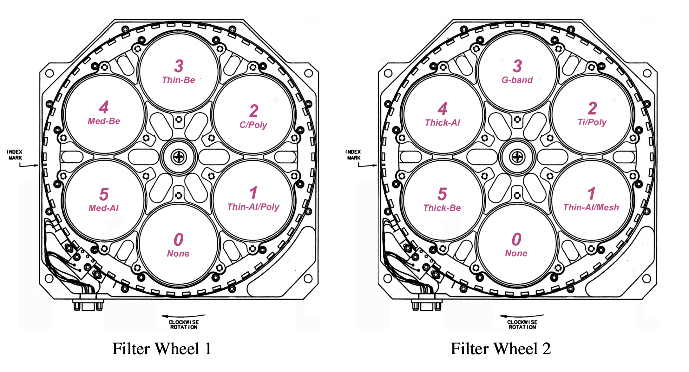

.. _xrtpy-about-xrt:

*********
About XRT
*********

Hinode
======

.. image:: _static/images/hinode_satellite.png
   :alt: Hinode Satellite
   :align: center

Hinode is a joint mission involving the space agencies of Japan, the United States, Europe,  and the United Kingdom.
It is depicted in the *illustration shown above*.
The spacecraft is equipped with three instruments: the Solar Optical Telescope (SOT), the Extreme Ultraviolet Imaging Spectrometer (EIS), and the X-Ray Telescope (XRT).
These instruments are designed to provide multi-wavelength data from the photosphere to the upper corona.
The solar spacecraft was launched at 6:36 a.m on September 23, 2006 (Japan Standard Time) and placed into a polar,  sun-synchronous orbit, enabling continuous observations of the Sun.
For further information, visit `NASA's Hinode space mission to the Sun`_.

.. _xrtpy-about-xrt-filters:

The X-Ray Telescope
===================

The X-Ray Telescope (XRT), depicted as a long linear black tube on the Hinode spacecraft is a crucial instrument for observing the solar corona's most intense regions, with temperatures ranging from 1,000,000 to 10,000,000 Kelvin.
The image below is a synoptic composite from February 14, 2015, created using the Al-Mesh/Be-Thin/Al-Med filters.
This method combines images taken with different filters, each set to a distinct color in the RGB color model to highlight various thermal conditions within the corona.
For a comprehensive overview of XRT's mission and capabilities, please visit the official xrt-cfa-harvard_ website.

.. tip::

   Visit the `XRT Picture of the Week`_ and the `Hinode-XRT YouTube`_ page for captivating visual content showcasing the XRT's solar observations.

XRT uses two sequentially positioned filter wheels, as shown in the diagram below, where each wheel houses a variety of filters.
By rotating these wheels, scientists can select different filters to study the Sun in different wavelengths, thereby enhancing the resolution and quality of solar images.
Refer to Section 3 in the "X-Ray Telescope Instrument Guide" in the `SolarSoft XRT Analysis Guide`_ for more information abo[ut the XRT filters.
The existing filters are structured as follows:

#. Filter Wheel Configuration
    #. Filter position
        #. Filter Wheel 1:
            -  *Open*
            -  Aluminum Polyimide (*Al-poly*)
            -  Carbon Polyimide (*C-poly*)
            -  Beryllium Thin (*Be-thin*)
            -  Beryllium Medium (*Be-med*)
            -  Aluminum Medium (*Al-med*)
        #. Filter Wheel 2:
            -  *Open*
            -  Aluminum Mesh (*Al-mesh*)
            -  Titanium Polyimide (*Ti-poly*)
            -  *G-band*
            -  Aluminum Thick (*Al-thick*)
            -  Beryllium Thick (*Be-thick*)
    #. *Open*
        Each filter wheel has an empty position, named 'Open'.
        The open position is in place when a filter on the other filter wheel is being used.
    #. *G-band*
        The G-Band filter allows visible light into the telescope and onto the CCD.
        XRTpy does not calculate the effective area or the temperature response for the G-Band filter.

.. note::

    Filters are expressed by their abbreviation when used in XRTpy.
    For example, if we want to explore the filter channel that selects the Titanium Polyimide filter, then the string would be ``'Ti-poly'``.
    The process is the same for all XRT filter channels.

Data Products
*************

The XRT website provides readily available `XRT data products`_, including both Level 1 and Level 2 data.
The `Level 1 Data`_ section contains an extensive archive of all Level 1 XRT data that has been calibrated using the `xrt_prep`_ routine, with units expressed in Data Numbers.
Additionally, for users interested in synoptic images, `Level 2 Synoptics`_ data is available, which consists of composite images from the twice-daily synoptic program.
These images have been processed and are available in the archive.
For more detailed information about our XRT data products, please visit the `XRT data products`_ site, where you can find comprehensive data resources and references.

.. _Level 1 Data: https://xrt.cfa.harvard.edu/level1/
.. _Level 2 Synoptics: https://xrt.cfa.harvard.edu/data_products/Level2_Synoptics/
.. _XRT data products: https://xrt.cfa.harvard.edu/data_products/index.php
.. _xrt_prep: https://xrt.cfa.harvard.edu/resources/documents/XAG/XAG.pdf

SolarSoft XRT Analysis Guide
============================

The `SolarSoft XRT Analysis Guide`_ is a comprehensive resource for analysis of XRT data.
It includes both an instrument guide and an overview of the x-ray telescope's hardware components.
The XRT software was originally created in the Interactive Data Language (IDL).

.. note::

   Please note that the `SolarSoft XRT Analysis Guide`_ does not serve as a guide for using XRTpy.
   It focuses solely on the analysis of XRT data using the IDL software.

.. _Hinode-XRT YouTube: https://www.youtube.com/user/xrtpow
.. _Interactive Data Language: https://www.l3harrisgeospatial.com/Software-Technology/IDL
.. _NASA's Hinode space mission to the Sun: https://www.nasa.gov/mission_pages/hinode/mission.html
.. _SolarSoft XRT Analysis Guide: https://xrt.cfa.harvard.edu/resources/documents/XAG/XAG.pdf
.. _XRT Picture of the Week: https://xrt.cfa.harvard.edu/xpow
.. _xrt-cfa-harvard: https://xrt.cfa.harvard.edu/index.php
