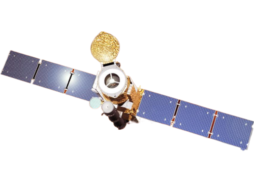

.. _xrtpy-about-xrt:

*********
About XRT
*********

Hinode
======

Hinode is a joint mission involving the space agencies of Japan, the United States, Europe,  and the United Kingdom.
It is depicted in the *illustration shown above*.
The spacecraft is equipped with three instruments: the Solar Optical Telescope (SOT), the Extreme Ultraviolet Imaging Spectrometer (EIS), and the X-Ray Telescope (XRT).
These instruments are designed to provide multi-wavelength data from the photosphere to the upper corona.
The solar spacecraft spacecraft was launched at 6:36 a.m on September 23, 2006 (Japan Standard Time) and placed into a polar,  sun-synchronous orbit, enabling continuous observations of the Sun.
For further information, visit `NASA's Hinode space mission to the Sun`_.

The X-Ray Telescope
===================

.. image:: _static/images/XRT_composite_image_full_disk_14February2015.png
   :alt: XRT Composite Image
   :align: center
   :scale: 50%

The X-Ray Telescope (XRT), depicted as a long linear black tube on the Hinode spacecraft is a crucial instrument for observing the solar corona's most intense regions, with temperatures ranging from 1,000,000 to 10,000,000 Kelvin.
The image below is a synoptic composite from February 14, 2015, created using the Al-Mesh/Be-Thin/Al-Med filters.
This method combines images taken with different filters, each set to a distinct color in the RGB color model to highlight various thermal conditions within the corona.
For a comprehensive overview of XRT's mission and capabilities, please visit the official xrt-cfa-harvard_ website.

.. tip::

   Visit the `XRT Picture of the Week`_ and the `Hinode-XRT YouTube`_ page for captivating visual content showcasing the XRT's solar observations.

SolarSoft XRT Analysis Guide
============================

The `SolarSoft XRT Analysis Guide`_ is a comprehensive resource for analysis of XRT data.
It includes both an instrument guide and an overview of the x-ray telescope's hardware components.
The XRT software was originally created in the Interactive Data Language (IDL).

.. note::

   Please note that the `SolarSoft XRT Analysis Guide`_ does not serve as a guide for using XRTpy.
   It focuses solely on the analysis of XRT data using the IDL software.

.. _Hinode-XRT YouTube: https://www.youtube.com/user/xrtpow
.. _Interactive Data Language: https://www.l3harrisgeospatial.com/Software-Technology/IDL
.. _NASA's Hinode space mission to the Sun: https://www.nasa.gov/mission_pages/hinode/mission.html
.. _SolarSoft XRT Analysis Guide: https://xrt.cfa.harvard.edu/resources/documents/XAG/XAG.pdf
.. _XRT Picture of the Week: https://xrt.cfa.harvard.edu/xpow
.. _xrt-cfa-harvard: https://xrt.cfa.harvard.edu/index.php
