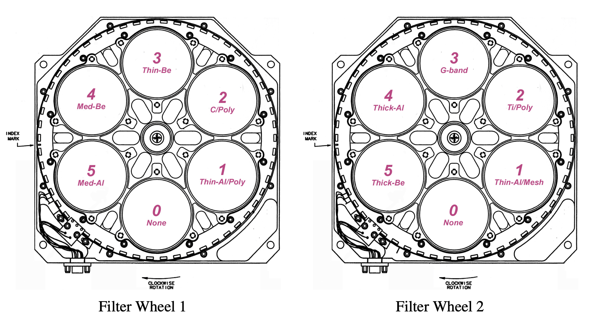

.. _xrtpy-getting-started:

===============
Getting Started
===============

XRTpy is a Python package being developed for the analysis of observations made by the X-Ray Telescope (XRT) on the board Hinode spacecraft.
This page is intended for new users of `xrtpy`. For more background information about XRT please refer to the `SolarSoft XRT Analysis Guide`_.

XRTpy Objects
*************

XRTpy currently offers *Channel*, *Effective Area*, and *Temperature Response* classes.
There is the ability to to derive temperatures and emission measures for a pair of images, sharpen images using a Point Spread Function (PSF) deconvolution, and to correct synoptic images for the light leak (visible stray light) that XRT has developed.
Visit our Example page for detail notebook example guides on how to use the XRTpy classes and functions.

Channel
-------

|Channel| is an instrument configuration class that contains the properties of particular XRT filters.
It provides a detailed information on the filter channel, including the Charge-Coupled Device (CCD), Entrance Filter, Focus-Filter(s), Geometry, and Mirror(s).

Effective Area
--------------

XRTpy calculates the effective areas for a set of XRT filter channels paired with thicknesses of the CCD contamination layer.
For more information about the instrumental spectral responses, refer to the `SolarSoft XRT Analysis Guide`_.

Temperature Response
--------------------

XRTpy calculates the temperature response for each XRT filter channel, assuming a spectral emission model, refer to :cite:t:`narukage:2011` and :cite:t:`narukage:2014`.
The XRT default emission model is `CHIANTI`_ atomic database version 10.0 with coronal abundances :cite:t:`feldman:1992`.
This structure contains data and information about a plasma emission model, as a function of wavelength and temperature.

Deriving Temperature and Emission Measure for a Pair of Images
--------------------------------------------------------------

XRTpy provides a routine, *temperature_from_filter_ratio*, that employs the objects listed above to derive the temperature and emission measure in for a given pair of images using the filter ratio method.
This uses the same methods as in the SolarSoft IDL routine of the same name.
Familiarize yourself with the utilization of this function through the notebook example provided on our Example page.

Enhancing Images Sharpness with Point Spread Function - Deconvolution
---------------------------------------------------------------------

Deconvolution is a powerful technique used to enhance image sharpness by mitigating the blurring effect
caused by the telescope's point spread function (PSF).
It is particularly useful for removing the blurring around sharp objects or features in the XRT image.
To learn how to use *deconvolve*, refer to the notebook examples provided on our Example page.

Subtracting Light Leak from XRT Synoptic Composite Images
---------------------------------------------------------

We have developed a specialized function designed to subtract light leak, *remove_lightleak*, which refers to visible stray light, from XRT synoptic composite images.
By applying this function, you can effectively remove the unwanted artifacts caused by light leak, resulting in cleaner and more accurate images for further analysis and interpretation.
Explore our Example page for a notebook example that demonstrate the usage of this function.

Abundance Model
---------------

The standard XRT temperature response routines are calculated assuming `CHIANTI`_ coronal abundances, :cite:t:`feldman:1992`.
Additionally, XRTpy offers the ability to choose two other sets of `CHIANTI`_ abundances i.e., Hybrid and Photospheric.
The Hybrid abundances are based on :cite:t:`Fludra:1999` and Photospheric abundances are base on :cite:t:`Grevesse:2007`.
The `CHIANTI`_ files contain data and information about a plasma emission model, as a function of wavelength and temperature.
Visit `XRT temperature response with other choice of abundances`_ for future detailed information.

.. note::

    XRTpy has future plans to accept other plasma emission spectra models.

XRTpy defaults to using CHIANTI's "coronal" abundance.
You can specify the other abundances by defining the abundance type name, such as "hybrid" or "photospheric" in the ``abundance_model`` parameter.

For example:

.. code-block:: python

    xrtpy.response.TemperatureResponseFundamental(
        "Al-poly", "2022/07/04T23:43:12", abundance_model="Hybrid"
    )

The ``abundance_model`` parameter is used in the same format in `xrtpy.response.temperature_from_filter_ratio`.

Data Products
*************

The XRT website provides readily available `XRT data products`_, including both Level 1 and Level 2 data.
The `Level 1 Data`_ section contains an extensive archive of all Level 1 XRT data that has been calibrated using the `xrt_prep`_ routine, with units expressed in Data Numbers.
Additionally, for users interested in synoptic images, `Level 2 Synoptics`_ data is available, which consists of composite images from the twice-daily synoptic program.
These images have been processed and are available in the archive.
For more detailed information about our XRT data products, please visit the `XRT data products`_ site, where you can find comprehensive data resources and references.

.. _Level 1 Data: https://xrt.cfa.harvard.edu/level1/
.. _Level 2 Synoptics: https://xrt.cfa.harvard.edu/data_products/Level2_Synoptics/
.. _XRT data products: https://xrt.cfa.harvard.edu/data_products/index.php
.. _xrt_prep: https://xrt.cfa.harvard.edu/resources/documents/XAG/XAG.pdf

.. _xrtpy-getting-started-filters:

X-Ray Filter Channel
********************

XRT uses two sequentially positioned filter wheels, as shown in the diagram below, where each wheel houses a variety of filters.
By rotating these wheels, scientists can select different filters to study the Sun in different wavelengths, thereby enhancing the resolution and quality of solar images.
Refer to Section 3 in the "X-Ray Telescope Instrument Guide" in the `SolarSoft XRT Analysis Guide`_ for more information abo[ut the XRT filters.
The existing filters are structured as follows:

#. Filter Configuration
    #. Filter position
        #. Filter Wheel 1:
            -  *Open*
            -  Aluminum Polyimide (*Al-poly*)
            -  Carbon Polyimide (*C-poly*)
            -  Beryllium Thin (*Be-thin*)
            -  Beryllium Medium (*Be-med*)
            -  Aluminum Medium (*Al-med*)
        #. Filter Wheel 2:
            -  *Open*
            -  Aluminum Mesh (*Al-mesh*)
            -  Titanium Polyimide (*Ti-poly*)
            -  *G-band*
            -  Aluminum Thick (*Al-thick*)
            -  Beryllium Thick (*Be-thick*)
    #. *Open*
        Each filter wheel has an empty position, named 'Open'.
        The open position is in place when a filter on the other filter wheel is being used.
    #. *G-band*
        The G-Band filter allows visible light into the telescope and onto the CCD.
        XRTpy does not calculate the effective area or the temperature response for the G-Band filter.

.. note::

    Filters are expressed by their abbreviation when used in XRTpy.
    For example, if we want to explore the filter channel that selects the Titanium Polyimide filter, then the string would be ``'Ti-poly'``.
    The process is the same for all XRT filter channels.

.. _CHIANTI: https://www.chiantidatabase.org/chianti_database_history.html
.. _SolarSoft XRT Analysis Guide: https://xrt.cfa.harvard.edu/resources/documents/XAG/XAG.pdf
.. _xrt-cfa-harvard: https://xrt.cfa.harvard.edu/index.php
.. _XRT temperature response with other choice of abundances: http://solar.physics.montana.edu/takeda/xrt_response/xrt_resp.html
