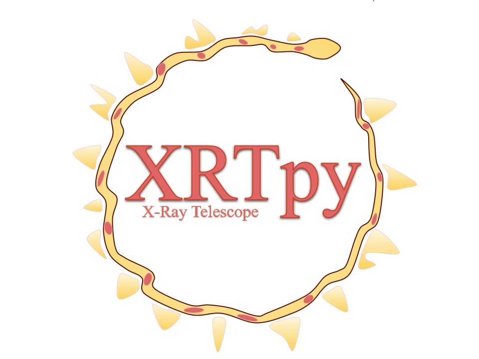

:tocdepth: 2

.. _xrtpy-documentation:

###################
XRTpy Documentation
###################

This is the documentation for XRTpy: a Python_ package being developed
for the analysis of observations made by the `X-Ray Telescope`_ (XRT)
:cite:p:`golub:2007` on the Hinode_ spacecraft :cite:p:`kosugi:2007`.

.. toctree::
   :maxdepth: 2
   :caption: Contents:

   install
   about_xrt
   getting_started
   examples
   bibliography
   glossary
   changelog/index
   feedback_communication
   CODE_OF_CONDUCT
   contributing/index

Indices and tables
==================

* :ref:`genindex`
* :ref:`modindex`
* :ref:`search`
